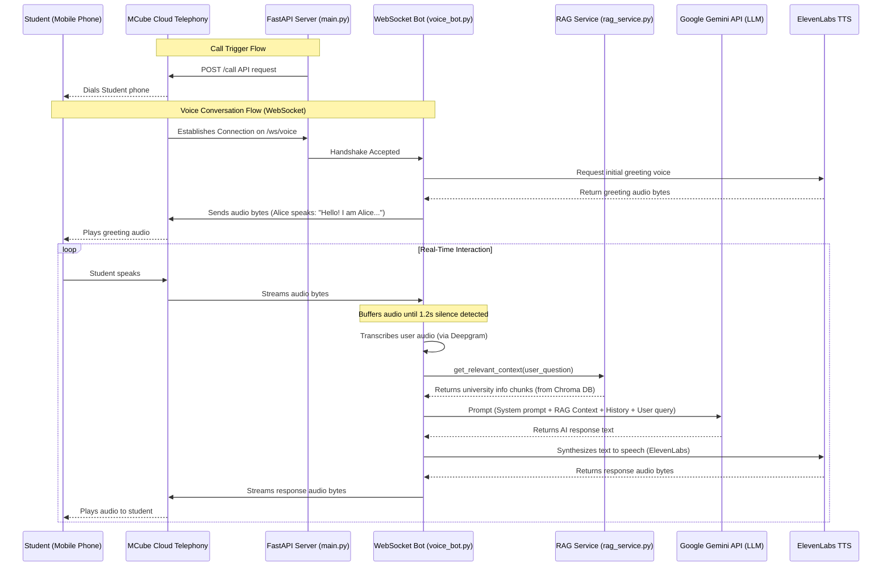

# CRM Calling Agent - Full Project Flow Guide

Is guide me aapko project ke saare files aur call/voice flow ko aasan bhasha (simple Hinglish) me samajhaya gaya hai.

---

## 1. Project Architecture & Flow Diagram

Jab student call par baat karta hai, toh data is flow me chalta hai:



---

## 2. File-by-File Explanation (Har Ek File Ka Kaam)

### 1. Root Configuration & Dependencies

#### 📂 [requirements.txt](file:///c:/Users/sharm/Desktop/CRM-Calling-Agent/requirements.txt)
* **Kaam:** Ye is project ki external libraries ki list hai. Jab hum `pip install -r requirements.txt` chalate hain, toh ye files download hoti hain:
  * `fastapi` & `uvicorn` (Fast API Server chalane ke liye)
  * `chromadb` (Student queries ke liye vector database)
  * `aiohttp` (Real-time APIs ko fast aur asynchronous call karne ke liye)
  * `deepgram-sdk` & `websockets` (Aawaz ko stream karne ke liye)

#### 📂 [.env](file:///c:/Users/sharm/Desktop/CRM-Calling-Agent/.env)
* **Kaam:** Isme saare secret keys aur setup configuration values hoti hain.
  * **MCube Keys:** Outbound Click2Call details.
  * **Gemini Key (`GEMINI_API_KEY`):** Google Studio se mili free AI API Key.
  * **Chroma DB Path:** Vector DB kaha store hoga (`backend/app/db/chroma`).

---

### 2. Application Entrypoint & Settings

#### 📂 [config.py](file:///c:/Users/sharm/Desktop/CRM-Calling-Agent/backend/app/config.py)
* **Kaam:** Ye `.env` file ko python me load karta hai.
* **Kaise kaam karta hai?** Ek class `Settings` banai gayi hai jo environment variables ko read karke `settings` naam ke object me save karti hai, jise baaki saare files import karti hain.

#### 📂 [main.py](file:///c:/Users/sharm/Desktop/CRM-Calling-Agent/backend/app/main.py)
* **Kaam:** Ye project ka main gate (entrypoint) hai jahan se FastAPI web server shuru hota hai.
* **Kaise kaam karta hai?** 
  * `app = FastAPI()` server instance banata hai.
  * Do main routes ko link (mount) karta hai: `/call` endpoint aur `/ws/voice` websocket gate.
  * Root path `/` par check karne ke liye ek simple `{"status":"running"}` response deta hai.

---

### 3. Telephony API Route

#### 📂 [call.py](file:///c:/Users/sharm/Desktop/CRM-Calling-Agent/backend/app/api/call.py)
* **Kaam:** Outbound (bahar jane wali) call trigger karne ke liye API route (`POST /call`).
* **Kaise kaam karta hai?** Jab hum is par request bhejte hain (e.g. `{"phone": "+91XXXXXXXXXX"}`), toh ye `MCubeService` ka use karke student ke phone par call lagane ka request initiate karta hai.

#### 📂 [mcube_service.py](file:///c:/Users/sharm/Desktop/CRM-Calling-Agent/backend/app/services/mcube_service.py)
* **Kaam:** MCube Click-to-Call API ke sath connect hone ka logic.
* **Kaise kaam karta hai?** Ye MCube ke outbound API URL par payload bhejta hai. Click2Call me ye sabse pehle aapke agent phone (`exenumber`) ko ring karega, aur aapke call uthate hi student (`custnumber`) ko ring mila dega.

---

### 4. RAG & Database System

#### 📂 [university_info.txt](file:///c:/Users/sharm/Desktop/CRM-Calling-Agent/backend/app/rag/university_info.txt)
* **Kaam:** Apex University ki basic informational text database (Courses, fees, address, admissions schedule).
* **Upyog:** Agar Chroma DB empty hai ya abhi setup nahi hua hai, toh hamara system is file ko search karke backup context read karta hai.

#### 📂 [rag_service.py](file:///c:/Users/sharm/Desktop/CRM-Calling-Agent/backend/app/rag/rag_service.py)
* **Kaam:** Student ke sawaal ke basis par sahi university information nikalna (Retrieval).
* **Kaise kaam karta hai?**
  1. Chroma DB client (`PersistentClient`) ko initialize karta hai.
  2. **BGE-M3 Embeddings:** Ek custom embedding function banaya gaya hai jo query ko vectors me badalne ke liye Hugging Face ki free Inference API use karta hai.
  3. Jab hum `get_relevant_context(user_query)` call karte hain, toh ye database se top-3 match hone wale chunks vectors nikal kar text generate karta hai.

---

### 5. Real-Time Conversation (Voice Bot)

#### 📂 [voice_bot.py](file:///c:/Users/sharm/Desktop/CRM-Calling-Agent/backend/app/websocket/voice_bot.py)
* **Kaam:** Call ke dauran aawaz ki real-time streaming, understanding aur reply karne ka dimaag (Brain).
* **Kaise kaam karta hai?**
  * `/ws/voice` route par MCube stream ke sath connection accept karta hai.
  * **Greeting:** Connect hote hi ElevenLabs se greeting sound compile karke call par bhejta hai.
  * **VAD/Silence Detection:** Jaise hi user bolna shuru karta hai, audio bytes buffer me jama hote hain. Agar `1.2 seconds` tak koi bolta nahi hai (chuppi), toh processing start ho jati hai.
  * **STT (Speech to Text):** Deepgram API audio buffer ko text me badal deta hai.
  * **RAG:** RAG service (`rag_service.py`) se student ke sawaal se match hone wali university details fetch ki jati hain.
  * **LLM (Gemini):** Google Gemini API ko prompt bheja jata hai: *"Aap university counsellor Alice hain, ye rahi university ki info. Student ne pucha '...' iska 1-3 line me reply do."*
  * **TTS (Text to Speech):** ElevenLabs API us reply text ko sweet voice me badalta hai aur call stream par return kar diya jata hai.

---

## 3. How to Run the App (Chalaane Ka Tareeqa)

1. Apni active terminal me virtual environment active karein:
   ```powershell
   venv\Scripts\activate
   ```
2. `.env` file ko open karke apni API Keys add karein:
   * `GEMINI_API_KEY` (Google AI Studio se free)
   * `DEEPGRAM_API_KEY` (Deepgram console se free)
   * `ELEVENLABS_API_KEY` (ElevenLabs console se free)
3. FastAPI backend server ko run karein:
   ```bash
   venv\Scripts\python -m uvicorn backend.app.main:app --reload --host 0.0.0.0 --port 8000
   ```
4. Server starts on `http://localhost:8000`. WebSocket path will be `ws://localhost:8000/ws/voice`.
